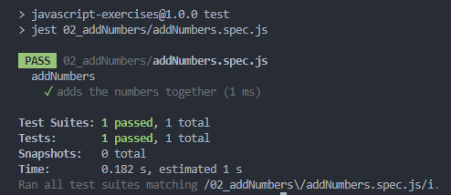
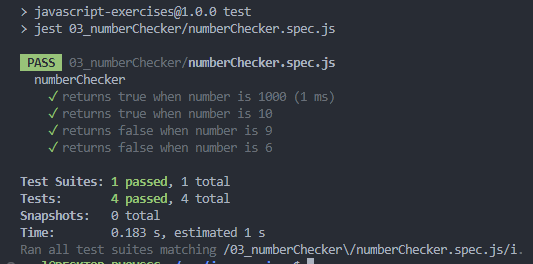

# Data Types And Conditionals

Practice with the fundamentals of JavaScript; designed to give a strong foundation.

- Completed as part of the **JavaScript Basics** section of the **Foundation Course** at [TheOdinProject](https://www.theodinproject.com).
- Taken from  the specified **javascript-exercises** repo, [specifically](https://github.com/TheOdinProject/javascript-exercises)

---

## Assignment Instructions

 - [01 - helloWord &rArr;](./js-exercises/01_helloWorld/)
 - [02 - addNumbers &rArr;](./js-exercises/02_addNumbers/)
 - [03 - numberChecker &rArr;](./js-exercises/03_numberChecker/)
 - [04 - mathEquations &rArr;](./js-exercises/04_mathEquations/)
 - [05 - joinStrings &rArr;](./js-exercises/05_joinStrings/)

## Results

<table>
<tr>

<td>

### 01 - helloWord

</td>
<td>

### 02 - addNumber

</td>
</tr>
<tr>
<td>

### 03 - numberChecker

</td>
<td>

### 04 - mathEquations

</td>
</tr>
<tr>
<td>

### 05 - joinStrings

</td>

</tr>
</table>

